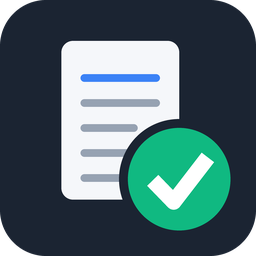

# 회의록 자동 작성 도구



회의 자료가 들어있는 폴더를 넣으면, 폴더마다 회의록 1건을 사업단 표준 양식의
**한글 문서(`.hwpx`)** 로 만들어 줍니다. 한글에서 바로 열어 고칠 수 있습니다.
API 키 없이 이 PC에 로그인된 Claude 구독으로 동작합니다.

---

## 다운로드

> **[⬇ 회의록도구.exe 내려받기](../../releases/tag/app-latest)**

저장소의 **Releases** 에서 `MeetingMinutes.exe` 를 내려받아 더블클릭하면 바로 실행됩니다.
파이썬 설치는 필요 없습니다. (GitHub 이 첨부파일 이름에 한글을 허용하지 않아 영문 이름입니다.
받은 뒤 `회의록도구.exe` 로 바꾸셔도 그대로 동작합니다.)

소스가 바뀌면 GitHub Actions 가 윈도우에서 자동으로 다시 빌드해 이 링크를 갱신합니다.
([Actions 탭](../../actions) 에서 진행 상황을 볼 수 있습니다.)

## 직접 만들기 — 다운로드 대신 내 PC 에서 빌드할 때

`앱 만들기.bat` 을 더블클릭하세요. 몇 분 뒤 같은 폴더에 **`회의록도구.exe`** 가 만들어집니다.

만들고 나면 이 `.exe` **파일 하나만** 있으면 됩니다.

- 더블클릭하면 바로 실행됩니다. `.bat` 도 파이썬도 필요 없습니다.
- 바탕화면이나 작업 표시줄에 끌어다 놓고 쓸 수 있습니다.
- 다른 PC 로 옮길 때도 이 파일 하나만 복사하면 됩니다.
  (단, 그 PC 에도 Claude Code 는 설치·로그인되어 있어야 합니다.)

> `.exe` 를 만들 때만 파이썬이 필요합니다. 없으면 `앱 만들기.bat` 이 알려줍니다.
> <https://www.python.org/downloads/> 에서 설치하고, 첫 화면에서
> **"Add Python to PATH"** 를 반드시 체크하세요.

## 준비물

**Claude Code** — 명령 프롬프트에서 `claude --version` 이 동작하고 로그인까지 되어 있어야 합니다.
이게 실제로 회의 자료를 읽고 회의록 내용을 씁니다.

## 사용법

1. `회의록도구.exe` 더블클릭
2. **＋ 회의 폴더 추가** 로 회의 1건의 자료 폴더를 넣거나,
   **＋ 상위 폴더 추가** 로 여러 회의 폴더가 든 상위 폴더를 한 번에 넣습니다.
   (창 위쪽에 드래그&드롭도 가능)
3. **출력 폴더 선택** 으로 저장 위치를 정합니다. (기본: 바탕화면 ＼ 회의록 생성)
4. **작업 시작** 을 누릅니다.
5. 완료된 줄을 더블클릭하면 만들어진 회의록이 열립니다.

`보완요청` 칸에 서류 간 날짜 불일치나 영수증 결제 시각 문제가 표시되며,
같은 내용이 회의록 문서 맨 위에도 적힙니다.

## 파일 설명

| 파일 | 설명 |
|---|---|
| `회의록도구.exe` | **완성된 프로그램.** Releases 에서 받거나 `앱 만들기.bat` 으로 만듭니다. |
| `앱 만들기.bat` | `.exe` 를 직접 만들 때 쓰는 실행기 |
| `build_app.py` | 실제 빌드 작업을 하는 스크립트 |
| `.github/workflows/` | 윈도우에서 `.exe` 를 자동 빌드해 Releases 에 올리는 설정 |
| `회의록도구.pyw` | 실행기 소스 (`.exe` 로 빌드되는 부분) |
| `core.py` | 기능 본체. 프로그램이 자동으로 받아갑니다 |
| `회의록도구 실행.bat` | `.exe` 없이 원본 소스로 바로 실행할 때 (개발/시험용) |
| `icon.ico` | 프로그램 아이콘 |

## 문제가 생겼을 때

**1) 창이 아예 뜨지 않는 경우**

`회의록도구.exe` 와 같은 폴더의 **`오류기록.txt`** 에 원인이 기록됩니다.

원본 소스로 실행해 오류를 화면에서 바로 보려면, 명령 프롬프트에서:

```
"회의록도구 실행.bat" debug
```

**2) "claude 명령을 찾을 수 없음"**

명령 프롬프트에서 `claude --version` 을 확인하세요. 동작하지 않으면 Claude Code 를
설치하고 컴퓨터를 다시 시작해야 합니다. npm 으로 설치한 `claude.cmd` 도 자동으로 찾습니다.

**3) 백신이 `.exe` 를 막는 경우**

PyInstaller 로 만든 프로그램은 드물게 오탐될 수 있습니다. 예외로 등록하거나,
`회의록도구 실행.bat` 으로 원본 소스를 그대로 실행해도 기능은 같습니다.

**4) `.bat` 을 직접 수정할 때 주의**

`.bat` 파일들은 **CRLF 줄바꿈 + ANSI(CP949) 인코딩**으로 저장해야 합니다.
메모장에서 저장할 때 인코딩을 `ANSI` 로 지정하세요. UTF-8 이나 LF 줄바꿈으로 저장하면
윈도우 명령 프롬프트가 파일을 잘못 해석해 실행되지 않습니다.

## 자동 업데이트

**`.exe` 는 처음 한 번만 받으시면 됩니다.** 파일이 교체되지 않습니다.

기능은 `core.py` 라는 별도 파일에 들어 있고, 프로그램을 켤 때마다 최신본을
조용히 내려받아 실행합니다. 그래서 기능이 바뀌어도 다시 받거나 교체할 일이 없습니다.

- 내려받은 기능 파일은 해시를 검증한 뒤에만 사용합니다.
- 기능 파일은 `%LOCALAPPDATA%\MeetingMinutesTool` 에 보관되어 프로그램 폴더를 어지럽히지 않습니다.
- 인터넷이 안 되면 마지막으로 받아 둔 기능 파일로 실행합니다.
- 드물게 실행기 자체를 바꿔야 할 때만 새 `.exe` 를 안내드립니다.

## 문체·판단 기준 바꾸기 — `규칙.txt`

프로그램을 처음 켜면 옆에 **`규칙.txt`** 가 만들어집니다. 메모장으로 열어 고치고
저장하면 **다음 [작업 시작] 부터 바로 반영됩니다.** 프로그램을 다시 켜지 않아도 되고,
`.exe` 를 새로 만들 필요도 없습니다.

- `#` 으로 시작하는 줄은 설명이라 무시됩니다.
- 기본값으로 되돌리려면 `규칙.txt` 를 지우고 프로그램을 다시 켜세요.
- 손대지 않은 `규칙.txt` 는 프로그램이 업데이트될 때 최신 기본 규칙으로 자동 갱신됩니다.
  직접 고친 파일은 업데이트해도 그대로 둡니다.

양식 고정값(사업명 등)은 `회의록도구.pyw` 의 `HEADER_TITLE`, `PROJECT_NAME`,
`DEFAULT_ORG` 에 있습니다. 이건 바꾸려면 `.exe` 를 다시 만들어야 합니다.
